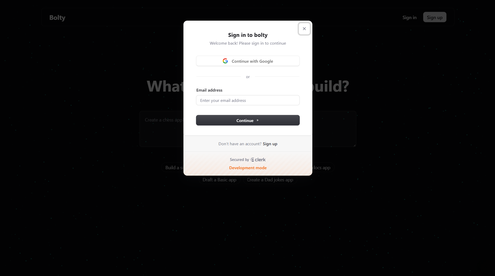
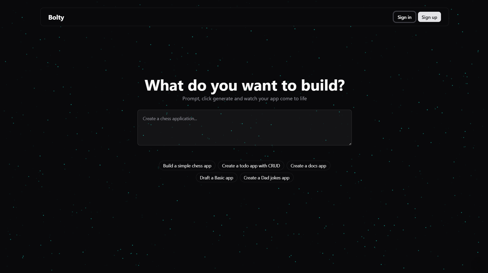
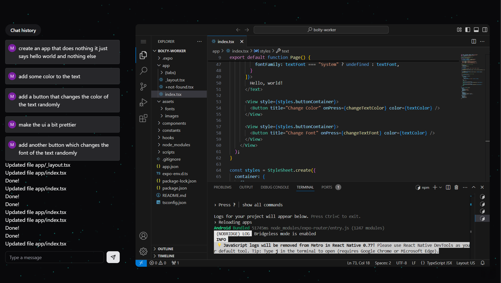

# Mobile‑Magic

Create fully functional Expo apps from simple natural‑language prompts using Gemini’s LLM 🚀

---

## 📝 Description

Mobile‑Magic lets you describe the app you want in plain English. Behind the scenes:

1. You log in via Clerk (Sign In / Sign Up).
2. You enter a prompt in the text area.
3. The prompt hits your Next.js frontend → Express primary backend → Bun “worker” backend.
4. The worker calls Gemini, which streams back a sequence of custom `<boltAction>` file and shell commands.
5. A parser processes those commands one by one, invoking file writes or shell installs inside a Docker‑hosted Expo project.
6. You see each step live in a web‑based VS Code instance (left pane shows actions/logs, right pane shows project files).
7. Finally, you can run the generated Expo app via `expo start` and connect with the Expo Go mobile app.

---

## 🚀 Tech Stack

- **Next.js** (Frontend)  
- **Express.js** (Primary Backend)  
- **Bun** (Worker Backend with LLM integration)  
- **Docker** (Containerize worker & vscode‑server)  
- **Turborepo** (Monorepo tooling)  
- **Expo** (Used by the LLM to scaffold and serve React Native apps)  

---

## 🖼️ Screenshots

1. **Sign In / Sign Up**  
   

2. **Prompt Input**  
   

3. **Web VS Code Instance**  
   

---

## 📋 Workflow

1. **Auth & Project List**  
   - User signs in/up with Clerk.  
   - Sidebar lists existing projects (fetched from Express + Prisma).

2. **Prompt → App Generation**  
   - User enters a prompt (e.g. “Build a todo app”).  
   - Frontend calls Express → passes JWT to Bun worker.  
   - Worker sends prompt + system instructions to Gemini LLM.  
   - Gemini streams back shell commands (`npm install …`) and file diffs.

3. **Parser & OS Executor**  
   - `ArtifactProcessor` parses `<boltAction>` tags.  
   - On “shell” actions, it runs - installs or scripts.  
   - On “file” actions, it writes/updates code in the Expo project.

4. **Live Preview & Editing**  
   - All actions appear in a live log pane.  
   - The right pane is a Docker‑hosted code‑server VS Code, showing real‑time file changes.  
   - User can also chat with the LLM in the UI to tweak code; changes update instantly.

5. **Run on Device**  
   - Once ready, run `expo start` in the worker container.  
   - Connect your phone via LAN URL (e.g. `exp://192.168.1.17:8081`) in Expo Go.  
   - Or build a standalone APK if desired.

---

## ⚖️ Inspiration

This project was inspired by [bolt.new](https://bolt.new) — all credit to the original team. Mobile‑Magic is an independent re‑implementation for learning and experimentation.

---

## Setup Guide

### 1. **Clone & Install**  

```bash
git clone https://github.com/sairam-mekala/Mobile-Magic.git
cd Mobile-Magic
npm install
```

### 2. **Env Setup**  

Change `.env` files with your keys:

```
DATABASE_URL=postgresql://...
JWT_PUBLIC_KEY=...
REDIS_URL=redis://localhost:6379
GOOGLE_API_KEY=...
CLERK_PUBLISHABLE_KEY=...
CLERK_SECRET_KEY=...
```

### 3. **Generate & Preview**  

Sign in at [http://localhost:3000](http://localhost:3000)

Enter your prompt, watch the vscode‑server at [http://localhost:8080](http://localhost:8080)

Run `npx expo start --host lan` inside the worker for mobile preview on Expo Go or use Expo Application Services (EAS) for the stand alone apk version
